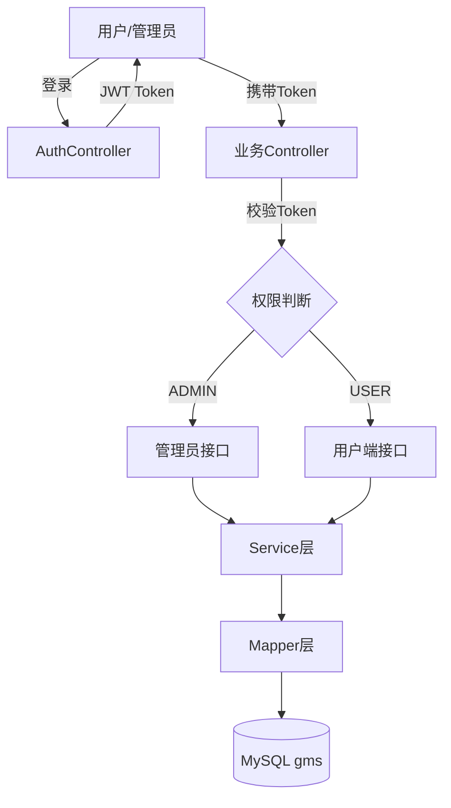

# architecture.md

> 本文件由项目启动架构师生成，描述系统架构、模块职责和关键设计决策。

## 项目目录结构

```
zwj/
├── GMS/                          # 后端 Spring Boot 项目
│   ├── pom.xml
│   └── src/main/java/com/gms/
│       ├── MainApplication.java  # 启动类
│       ├── Config/
│       │   ├── CorsConfig.java          # 跨域配置
│       │   └── MyMetaObjectHandler.java # 自动填充处理器
│       ├── controller/
│       │   ├── AuthController.java           # 认证：登录/注册/登出
│       │   ├── UserController.java           # 用户管理（admin）
│       │   ├── AreaController.java           # 区块管理
│       │   ├── PlantSpeciesController.java   # 植物品种管理
│       │   ├── PlantingRecordController.java # 种植记录
│       │   ├── MaintenanceRecordController.java # 养护记录
│       │   └── StatsController.java          # 统计数据
│       ├── service/                # 业务逻辑接口
│       │   └── impl/               # 业务逻辑实现
│       ├── mapper/                 # 数据访问层
│       ├── pojo/                   # 实体类
│       ├── utils/
│       │   ├── JwtHelper.java      # JWT 工具
│       │   └── Result.java         # 统一响应封装
│       └── exception/
│           └── GlobalExceptionHandler.java # 全局异常处理
├── green-admin/                  # 前端 Vue 项目
│   ├── package.json
│   ├── vue.config.js             # 开发服务器 + 代理配置
│   └── src/
│       ├── main.js               # 入口
│       ├── App.vue               # 根组件
│       ├── api/                  # API 请求封装
│       ├── components/           # 公共组件
│       ├── home/                 # 首页模块
│       ├── login/                # 登录模块
│       ├── router/               # 路由
│       ├── utils/                # 工具（token管理、事件总线）
│       └── assets/               # 静态资源
├── gms.sql                       # 数据库建表脚本
└── gms(1).md                     # API 接口文档
```

## 模块职责说明

| 模块/目录 | 职责 | 备注 |
|-----------|------|------|
| AuthController | 用户认证（登录/注册/登出） | 用户端 + 管理员双入口 |
| UserController | 用户 CRUD（管理员） | `/admin/users` 前缀 |
| AreaController | 绿化区块管理 | 区块是核心业务实体 |
| PlantSpeciesController | 植物品种管理 | 被种植/养护记录引用 |
| PlantingRecordController | 种植记录管理 | 关联区块 + 品种 |
| MaintenanceRecordController | 养护记录管理 | 关联区块 + 品种 |
| StatsController | 首页统计数据 | dashboard + 活动 + 分布 |
| JwtHelper | JWT Token 生成/解析 | 有效期 120 分钟 |
| Result | 统一响应格式 | `{code, message, data}` |

## 核心数据流


## 关键设计决策

1. **双角色认证**：管理员和用户使用同一张 `user` 表，通过 `role` 字段区分 — 原因：简化权限模型，减少表数量
2. **外键约束**：`planting_record` 和 `maintenance_record` 通过外键关联 `area` 和 `plant_species` — 原因：保证数据完整性
3. **自动填充**：`createdTime`、`updatedTime` 通过 MyMetaObjectHandler 自动注入 — 原因：避免每个接口手动设置
4. **前后端分离**：Vue 开发服务器代理到 Spring Boot 后端 — 原因：开发环境避免 CORS 问题

## 外部依赖与集成点

| 服务 | 用途 | 接入方式 |
|------|------|----------|
| MySQL 9.7 | 数据持久化 | JDBC + Druid 连接池 |
| JWT | 用户认证 | jjwt 库，Bearer Token |

## 开发注意事项
- 数据库初始密码配置在 `application.yml`，生产环境必须修改
- `area` 表主键 `area_id` 为 varchar(20)，非自增，需手动分配
- `user` 表 `maintenance_count` 和 `planting_count` 为冗余计数字段
- 外键约束为 RESTRICT，删除关联数据前需检查引用

## UI Design Specs
> 本项目使用 Element UI 标准后台管理布局，无自定义设计规范。

<!--
### 设计风格
- [待填充]

### 色彩规范
| 用途 | 色值 | 说明 |
|------|------|------|

### 字体规范
- [待填充]

### 组件模式
- [待填充]

### 间距系统
- [待填充]

### 交互模式
- [待填充]

### 原型文件
- 定稿原型: `prototype/index.html`
- 定稿日期: YYYY-MM-DD
-->
