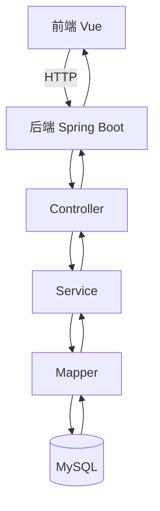

# architecture.md

> 本文件描述系统架构、模块职责和关键设计决策。

## 项目目录结构

```
zwj/
├── GMS/                            # 后端 Spring Boot 项目
│   └── src/main/java/com/gms/
│       ├── Config/                 # 配置类
│       ├── controller/             # 控制器层（8个）
│       ├── service/impl/           # 业务层
│       ├── mapper/                 # 数据访问层
│       ├── pojo/                   # 实体类
│       ├── utils/                  # 工具类
│       └── exception/              # 异常处理
├── green-admin/                    # 前端 Vue 项目
│   └── green_admin/src/
│       ├── api/api/                # API封装（7个模块）
│       ├── components/             # 公共组件
│       ├── home/                   # 页面组件（10个）
│       ├── login/                  # 登录/注册
│       ├── router/                 # 路由配置
│       └── utils/                  # 工具函数
├── gms.sql                         # 数据库脚本（6张表）
├── api-docs/openapi.yaml           # 接口文档
└── *.md                            # 项目文档
```

## 模块职责说明

| Controller | 职责 | 接口前缀 |
|------------|------|----------|
| AuthController | 登录/注册/登出/修改密码/用户信息 | /auth/* |
| AreaController | 区块CRUD | /areas, /admin/areas |
| PlantSpeciesController | 植物品种CRUD | /plants/species, /admin/plants/species |
| PlantingRecordController | 种植记录CRUD（关联查询） | /planting/records |
| MaintenanceRecordController | 养护记录CRUD（关联查询） | /maintenance/records |
| UserController | 用户列表/编辑/删除 | /admin/users |
| StatsController | 统计/活动/分布 | /stats/* |
| OperationLogController | 操作日志查询 | /admin/logs |

## 核心数据流



## 关键设计决策

1. **双角色登录**：管理员/用户不同接口，跳转不同页面
2. **操作日志**：Controller层记录，JWT解析当前用户
3. **关联查询**：种植/养护记录关联area和plant_species
4. **前端代理**：vue.config.js代理所有API到8080端口
5. **ECharts图表**：首页柱状图+饼图可视化

## 外部依赖

| 服务 | 用途 |
|------|------|
| MySQL 9.7 | 数据存储 |
| ECharts | 图表可视化 |
| Element UI | UI组件库 |
| JWT | 认证 |
